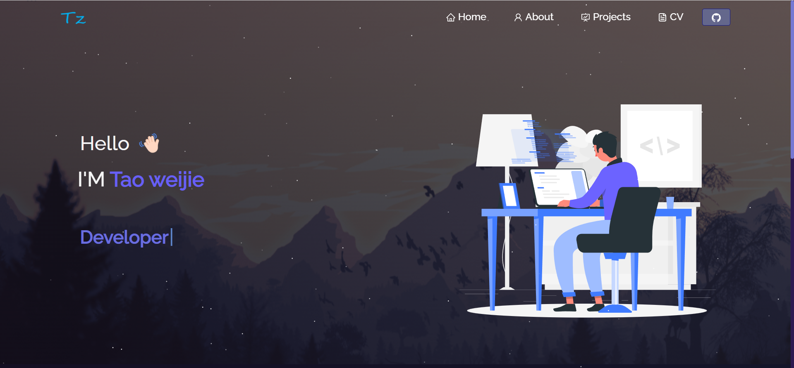

<h2 align="center">
  Portfolio Website 
  <a href="http://soumya-jit.tech/" target="_blank">tao.weijie</a>
</h2>

  

## Open Source

You can fork this repo to modify and make changes of your own. Please give me a ⭐. Thanks!

## Built With

My personal portfolio <a href="" target="_blue">Tao.weijie </a> which features some of my github projects as well as my resume and technical skills.  

This project was built using these technologies.

- React.js
- Node.js
- CSS3
- Tailwindcss
- VsCode

## Getting Started

Clone down this repository. You will need `node.js` and `git` installed globally on your machine.

## 🛠 Installation and Setup Instructions

1. Installation: `npm install`
2. In the project directory, you can run: `npm start`

Runs the app in the development mode.
Open [http://localhost:3000](http://localhost:3000) to view it in the browser.
The page will reload if you make edits.

### Show your support

Give a ⭐ if you like this website!
